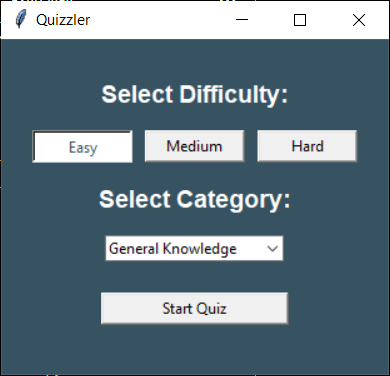
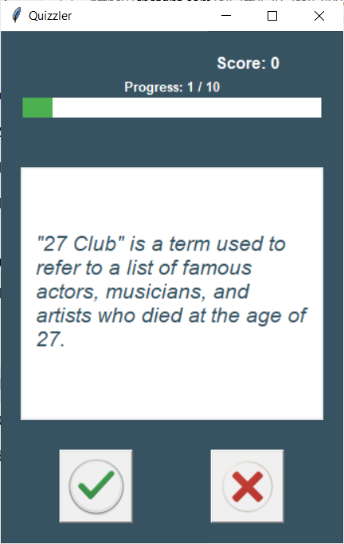
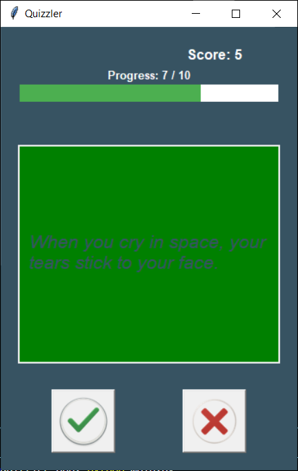
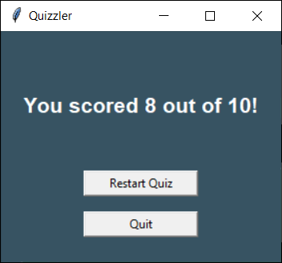

# 🧠 Quizzler App – Interactive Python Quiz Game

**Type:** Intermediate Python GUI Project  
**Built With:** `Python`, `tkinter`, `Pillow`, `requests`, `Open Trivia DB API`

---

## 🔍 Overview

Quizzler is an interactive True/False quiz game that pulls real trivia questions from the [Open Trivia DB API](https://opentdb.com/api_config.php). Players select a category and difficulty level, answer multiple questions, and receive real-time score updates with visual feedback and a dynamic progress bar.

---

## 🎥 Demo


---

## ✅ Features

### 📌 Core Functionality
- Live trivia questions fetched from an online API
- GUI built using `tkinter`
- Object-oriented structure with classes (`Question`, `QuizBrain`, `QuizInterface`)
- True/False answer buttons with immediate feedback

### 🛠 Feature Breakdown

#### Phase 1: MVP
- Display questions and score
- Fetch data from API
- True/False buttons with result feedback

#### Phase 2: Quiz Customization
- Difficulty selection (Easy, Medium, Hard)
- Category dropdown with mapped IDs
- Error handling for no results or bad API responses
- "Back to Start" option when quiz fails to load

#### Phase 2.5: Finishing Flow
- Final score summary screen
- Restart quiz or quit options

#### Phase 3: UI Feedback
- Dynamic progress bar showing quiz completion status
- Progress label: “Progress: 4 / 10”

#### Phase 4: Visual Polish
- Hover effects for buttons
- Cursor change to pointer (`hand2`) on interactive elements
- Smooth fade-in animation when displaying each new question

---

## 🖼 Screenshots

| Start Screen | Question Loaded |
|--------------|------------------|
|  |  |

| Correct Feedback | Incorrect Feedback | Final Score |
|------------------|--------------------|-------------|
|  |  |  |

---

## 🚀 How to Run Locally

1. Clone the repo:
```bash
git clone https://github.com/your-username/quizzler-app.git
cd quizzler-app
```

2. Install required packages:
```bash
pip install -r requirements.txt
```

3. Run the app:
```bash
python main.py
```

---

## 🧠 What I Learned

- Integrating third-party APIs and parsing JSON responses
- Applying object-oriented principles to manage UI, data, and logic
- Improving UX with animations and hover interactions in `tkinter`
- Designing scalable, modular Python apps

---

## 🛠 Tech Stack

- Python 3.x
- `tkinter` – for GUI rendering
- `requests` – for API communication
- `Pillow` – for image handling
- Open Trivia DB – trivia question data

---

## 🚧 Future Improvements

- 💾 Save high scores locally
- 🌗 Add theme toggle (light/dark mode)
- 📊 Add timer countdown
- 📱 Make mobile-friendly with `customtkinter` or convert to web app with `Flask`

---

## 📂 Project Structure

```
quizzler-app/
│
├── assets/                   # Button images (true.png, false.png)
├── media/
│   ├── demo/                 # GIF demo
│   └── screenshots/          # Static screenshots for README
├── api_handler.py            # Handles Open Trivia API logic
├── main.py                   # Entry point
├── question_model.py         # Question data class
├── quiz_brain.py             # Quiz logic and flow control
├── ui.py                     # All GUI logic and visuals
├── utils.py                  # (Currently unused, placeholder for helpers)
├── requirements.txt          # Pip dependencies
├── .gitignore                # Ignore rules
└── README.md                 # You are here!
```

---